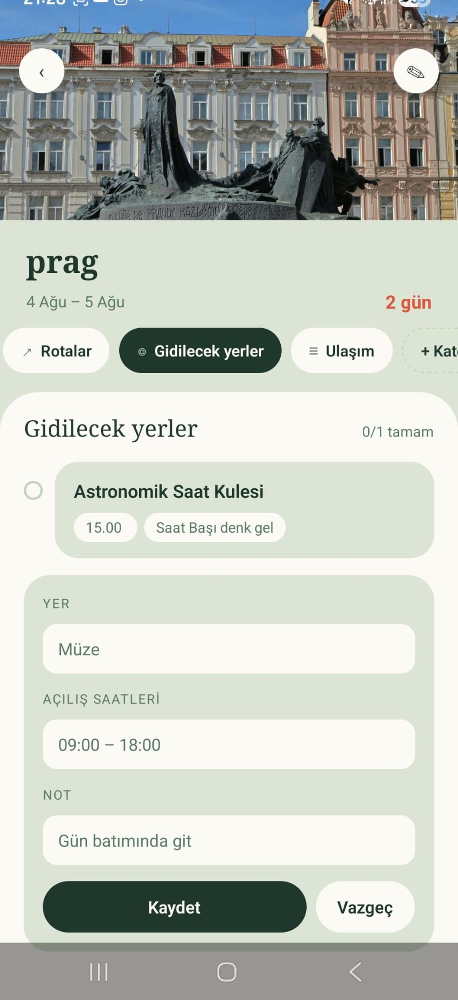
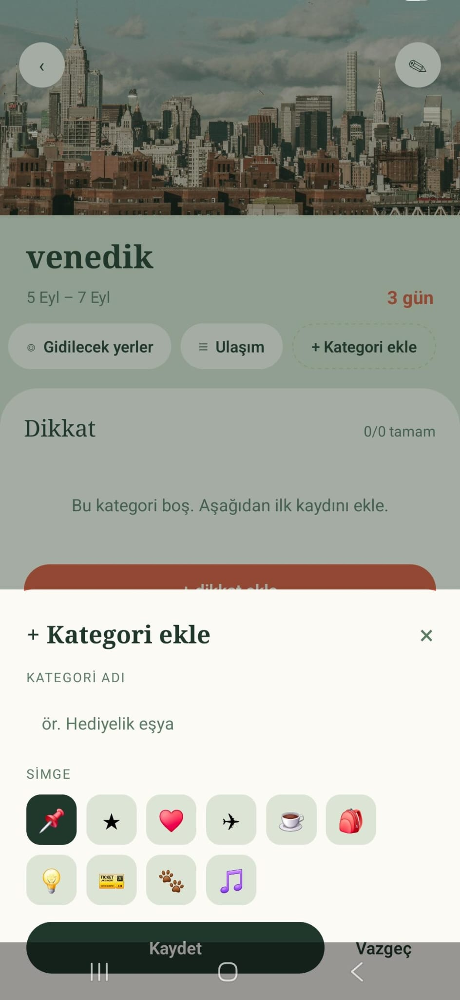
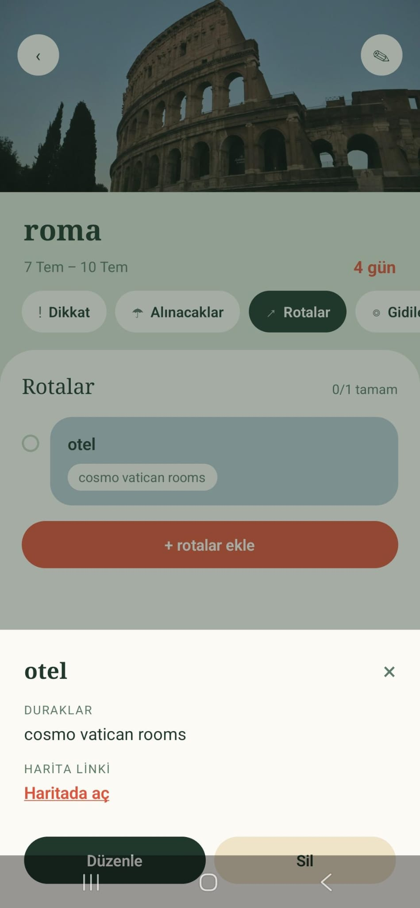
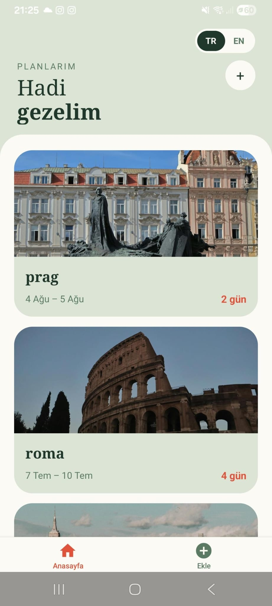

# Let's Travel

Seyahatlerini kolayca planlamanı sağlayan bir mobil uygulama. Farklı seyahat
kategorilerini ayrı ayrı düzenleyebilir, her biri için kendi bilgilerini
tutabilirsin.

## Özellikler
- Kategori bazlı seyahat planlama
- Her kategori için özelleştirilmiş alanlar
- Mobil öncelikli arayüz
 
## Ekran Görüntüleri
 
 

## Kullanılan Teknolojiler
- React Native (Expo)
- TypeScript

## Kurulum
```bash
npm install
npx expo start
```
Ardından Expo Go uygulaması ile telefonundan ya da bir emülatör üzerinden
açabilirsin.
